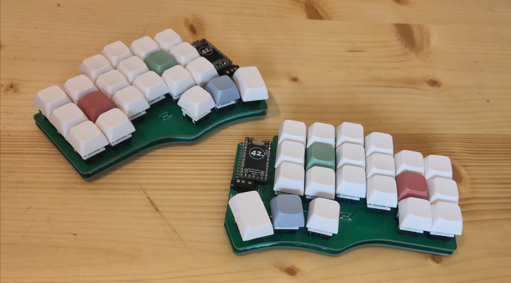
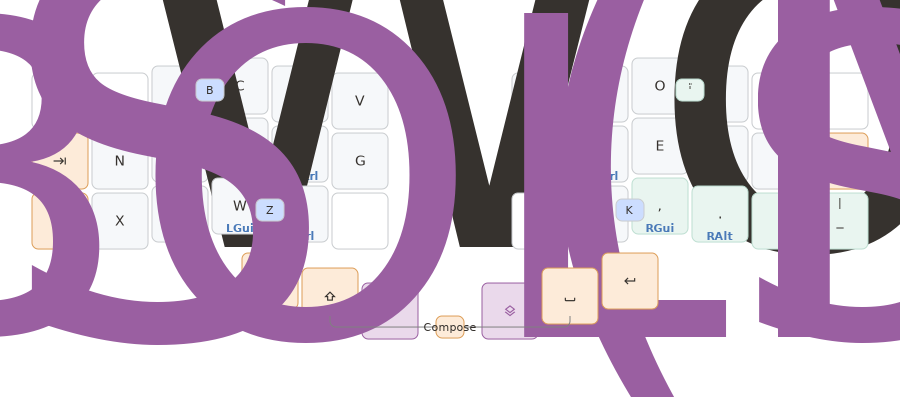
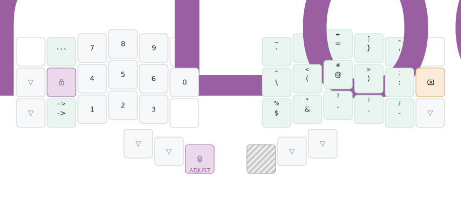
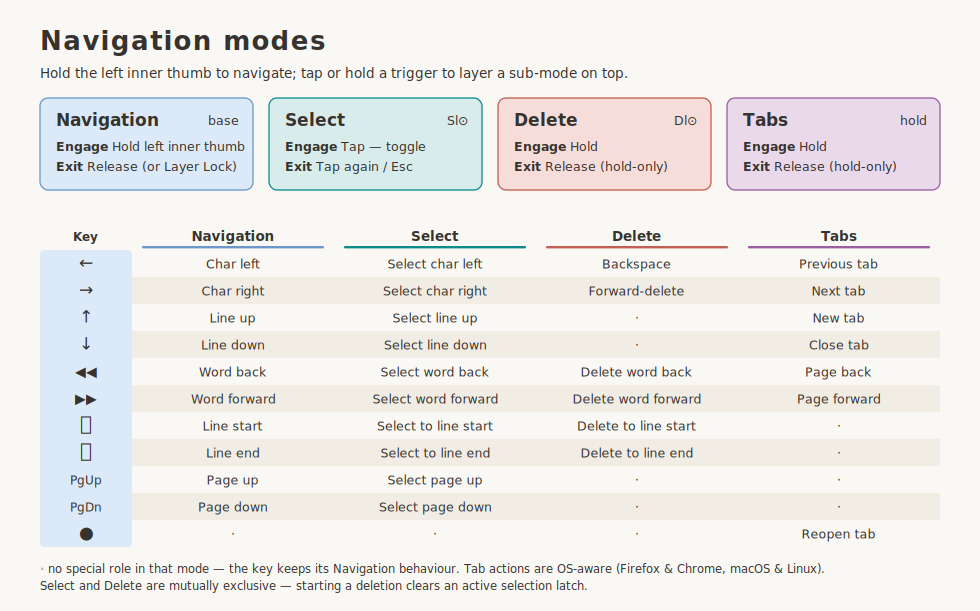

# Xavier's 3x6+3 Keymaps



Keymaps for **3x6+3** keyboards.

Two layouts live in this repository: 

- **`zen`**, a minimal QWERTY fallback (3 layers, no custom features)
- **`crafted`**, is my daily driver, described below.

## The `crafted` keymap

`Crafted` is the keymap I've built to be easy to memorize and bear low cognitive overhead.

### Main features

- **Gallium East** as the (configurable) base alphanum layout
- **Navigation cluster** with per-character/word/line and forward/backward motions, without modifiers.
- **Select and Delete modes** enabled in the navigation cluster
- **Compose key** for diacritics
- **Numpad on the left hand** helps maintain the right hand on the mouse.
- **OS-aware keys**: Cut/Copy/Paste, app/window switching, unified Ctrl/Cmd key, enable consistent access across macOS and Linux
- Symbols reorganized by frequency: opening brackets on the index column, and pairs kept together as much as possible.

> [!IMPORTANT]
> By design, the top left and top right keys are never used bevause they're too uncomfortable to reach.

### The layers

<!-- KEYMAP DRAWER -->




<!-- END KEYMAP DRAWER -->



> [!NOTE]
> A printable PDF lives at [`keymap_drawer/crafted.pdf`](./keyboards/6x3_3/keymaps/crafted/keymap_drawer/crafted.pdf).

### Reference tables

> [!NOTE]
> Searchable, greppable text twins of the tables above. Auto-generated from
> `keymap_drawer/make_*_page.py`.

<details>
<summary><strong>Navigation modes</strong></summary>

FAVS cursor layer + Select / Delete / Tabs sub-modes

<!-- BEGIN NAV TABLE -->

| Key | Navigation (FAVS layer) | Select (tap Sl⊙) | Delete (hold Dl⊙) | Tabs (hold tab key) |
|-----|------|------|------|------|
| ◀ | Char left | Select char left | Backspace | Previous tab |
| ▶ | Char right | Select char right | Forward-delete | Next tab |
| ▲ | Line up | Select line up | · | New tab |
| ▼ | Line down | Select line down | · | Close tab |
| ◀◀ | Word back | Select word back | Delete word back | Page back |
| ▶▶ | Word forward | Select word forward | Delete word forward | Page forward |
| ⏮ | Line start | Select to line start | Delete to line start | · |
| ⏭ | Line end | Select to line end | Delete to line end | · |
| PgUp | Page up | Select page up | · | · |
| PgDn | Page down | Select page down | · | · |
| ● | · | · | · | Reopen tab |

`·` = the key keeps its Navigation role in that mode. Select and Delete are mutually exclusive. Tab actions are OS-aware (Firefox & Chrome, macOS & Linux).

<!-- END NAV TABLE -->

</details>

<details>
<summary><strong>Compose &amp; diacritics</strong></summary>

Type `Shift + Space` while on BASE, then a key.

<!-- BEGIN DIACRITICS TABLE -->

| Key | Produces | Example |
|-----|----------|---------|
| `e` | ´ acute (dead key) | `Shift+Space`, `e`, `e` → é |
| `a` | \` grave (dead key) | `Shift+Space`, `a`, `e` → è |
| `u` | ¨ diaeresis (dead key) | `Shift+Space`, `u`, `e` → ë |
| `o` | ˆ circumflex (dead key) | `Shift+Space`, `o`, `e` → ê |
| `c` | ç | `Shift+Space`, `c` → ç |
| `n` | ñ | `Shift+Space`, `n` → ñ |
| `w` | € (euro) | `Shift+Space`, `w` → € |

Armed from the **base layer** with Shift + Space. Dead keys wait for a base letter, so the same accent works on any vowel; any unlisted key cancels.

<!-- END DIACRITICS TABLE -->

</details>

### Building

I have run the keymaps on the following MCUs:

| MCU | Example Keyboard | 
|----------|-----|
| STM32 | **Kaly42** (`kaly/kaly42`) |
| RP2040 | **Cantor Pro v3** (`42keebs/cantor_pro/v3/left`) |

```bash
qmk compile -kb kaly/kaly42 -km crafted
qmk compile -kb 42keebs/cantor_pro/v3/left -km crafted
```

All targets at once:

```bash
qmk userspace-compile
```

## Inspiration

- **[HandsDown](https://sites.google.com/alanreiser.com/handsdown)** — semantic, platform-aware editing commands
- **[Gallium](https://github.com/GalileoBlues/Gallium) East** — the alpha layout
- **Pascal Getreuer's QMK work** — Chordal Hold, Caps Word, and the wider tap-hold tuning vocabulary
- **Callum-style oneshot modifiers** — an early influence, since fully replaced by layer-scoped latches and plain momentary mods
- **[keymap-drawer](https://github.com/caksoylar/keymap-drawer)** — the layer diagrams

## License

GPL-2.0-or-later (following QMK licensing)
