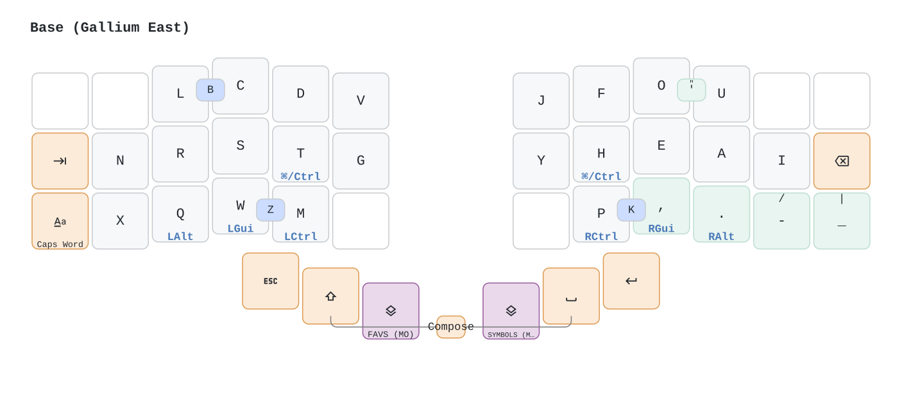
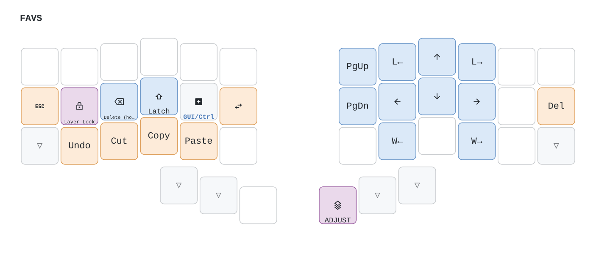
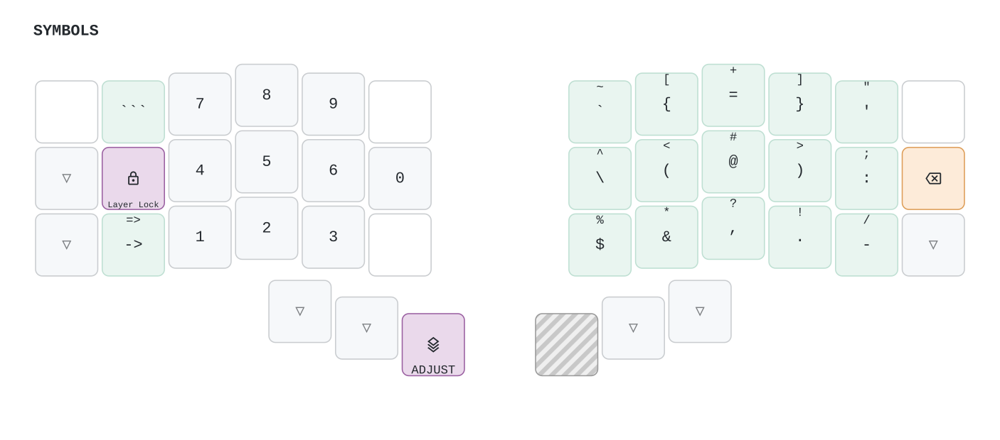
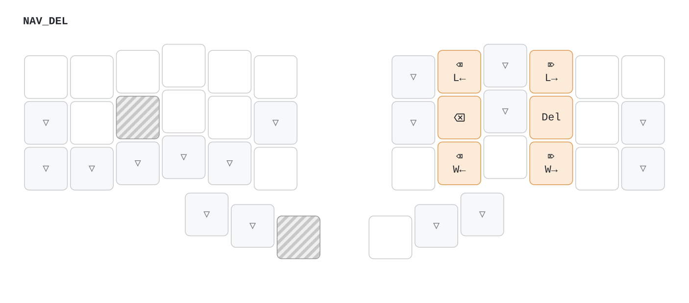
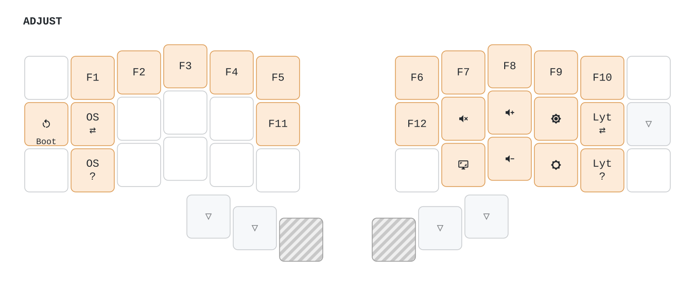

# Xavier's Split Keyboard Keymaps


QMK keymaps for keyboards with a **3x6+3** layout.

Two keymaps live here: 

- **`zen`**, a minimal QWERTY fallback (3 layers, no custom features)
- **`crafted`**, the daily driver described below.

I have run the keymaps on the following keyboards:

| Keyboard | MCU | Firmware |
|----------|-----|----------|
| **Kaly42** (`kaly/kaly42`) | STM32 | `.bin` |
| **Cantor Pro v3** (`42keebs/cantor_pro/v3/left`) | RP2040 | `.uf2` |

## The `Crafted` keymap

> [Click here](#the-layers) if you want to go straight to an overview of the keymaps

`Crafted` is an opinionated keymap built around **Gallium East** as its base alpha layer, alongside two main layers (`NAV/FAVS` and `SYMBOLS`), an `ADJUST` layer for functions, and a hold-only delete sub-layer (reachable from `NAV/FAVS`).


### Design principles

A lot of effort went into building a keymap that is easy to memorize and requires low cognitive overhead. Therefore, the design sticks to three rules:

1. **No sticky state.** Every piece of state is either momentary (dies with the key) or layer-scoped (dies with the layer). Nothing queues, nothing times out, nothing needs remembering.
2. **Cross-layer consistency.** The same output lives on the same physical position on every layer, even when that costs space. One spatial memory per symbol. Especially important for Modifiers and the whole thumb cluster.
3. **No dual-function keys.** With the exception of the mod-taps (bottom row, plus GUI/Ctrl on the index home keys), no single key has a dual behavior that would depend on hold, tap-dance or otherwise. It complements the cross-layer consistency, making the keymap easy to learn.

### Key mechanisms

What you'd actually notice with this keymap:

- **Single-purpose thumbs**: `Esc · Shift · NAV ‖ SYM · Space · Enter`, the same on every layer; no tap-hold logic anywhere on the cluster.
- **Compose for diacritics**: tap Shift+Space together, then `E/A/U/O` for an acute/grave/diaeresis/circumflex dead key, and additionally `C`→ç, `N`→ñ, `W`→€; any other key passes through unchanged.
- **Navigation** features:
  - **Modifier-free motions**: per-character/word/line and forward/backward navigation, each on a single key. No modifier chords involved.
  - **Select latch**: on `NAV`, tap once and Shift stays held while you arrow around for selection; it releases with the layer (or via Esc). Text selection never requires holding a key.
  - **Hold-to-delete**: still on `NAV`, hold the ring finger and the horizontal motions become deletions at the same granularity (line / char / word).
- **One-handed numpad**: `SYMBOLS` puts calculator-order digits on the left hand; with Layer Lock, numbers can be entered while the right hand stays on the mouse.
- **Secondary base layer**: a second alpha layout (QWERTY by default, via `XC_SECONDARY_LAYOUT`) toggled from `ADJUST` — useful when transitioning between layouts without reflashing.

#### Other honorable features

Some features are available for convenience:
- **Symbols organized by traffic**: the most-used symbols sit on the strongest fingers: `=+` and `@#` on the middle finger, opening brackets on the index column, closing brackets on the ring (cheap, since editors auto-close). Punctuation is consistent between `BASE` and `SYMBOLS`, and related siblings are as much as possible organized by pairs.
- **Swapper**: hold-free window switching — one key repeats Cmd/Alt-Tab while the firmware holds the modifier for you, releasing it when you leave the layer.
- **Platform independence**: clipboard, word/line navigation, deletions, accents, and the GUI/Ctrl modifier resolve at runtime to the correct macOS or Linux chords; the active OS is toggled (and can be printed) from `ADJUST`.
- **Weak corners** (optional): the four hardest-to-reach corner keys are disabled and their letters (B, ', Z, K) are produced by pressing the two neighboring keys together, keeping pinkies and indexes off the worst diagonals.
- **Caps Word**: dedicated key for `SCREAMING_SNAKE` and friends; survives the custom underscore and capitalizes combo-produced letters.

### The layers

<!-- KEYMAP DRAWER -->





<!-- END KEYMAP DRAWER -->

> [!NOTE]
> #### Legend
> - ▽ = transparent (falls through to a real key below)
> - red = held to stay on the layer
> 
> A printable PDF lives at [`keymap_drawer/crafted.pdf`](./keyboards/6x3_3/keymaps/crafted/keymap_drawer/crafted.pdf).

### Building

```bash
qmk compile -kb kaly/kaly42 -km crafted
qmk compile -kb 42keebs/cantor_pro/v3/left -km crafted
```

With a different base layout:

```bash
XC_LAYOUT=graphite qmk compile -kb kaly/kaly42 -km crafted
```

Build options (`rules.mk` or environment):

- **`XC_LAYOUT`** (default: `gallium_east`) — base layout: `qwerty`, `gallium`, `gallium_east`, `focal`, `graphite`
- **`XC_SECONDARY_LAYOUT`** (default: `qwerty`) — the alternate base layer, toggled from `ADJUST`
- **`XC_WEAK_CORNERS`** (default: `yes`) — corner letters via combos
- **`XC_ALT_BASE_SYMBOLS`** (default: `yes`) — semantic shift pairs on the base layer

All targets at once:

```bash
qmk userspace-compile
```

## Inspiration

- **[HandsDown](https://sites.google.com/alanreiser.com/handsdown)** — semantic, platform-aware editing commands
- **[Gallium](https://github.com/GalileoBlues/Gallium) East** — the alpha layout
- **Pascal Getreuer's QMK work** — Chordal Hold, Caps Word, and the wider tap-hold tuning vocabulary
- **Callum-style oneshot modifiers** — an early influence, since fully replaced by layer-scoped latches and plain momentary mods
- **[keymap-drawer](https://github.com/caksoylar/keymap-drawer)** — the layer diagrams

## License

GPL-2.0-or-later (following QMK licensing)
