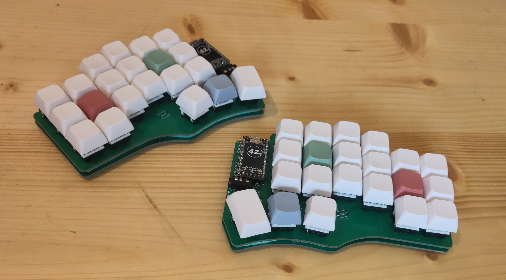
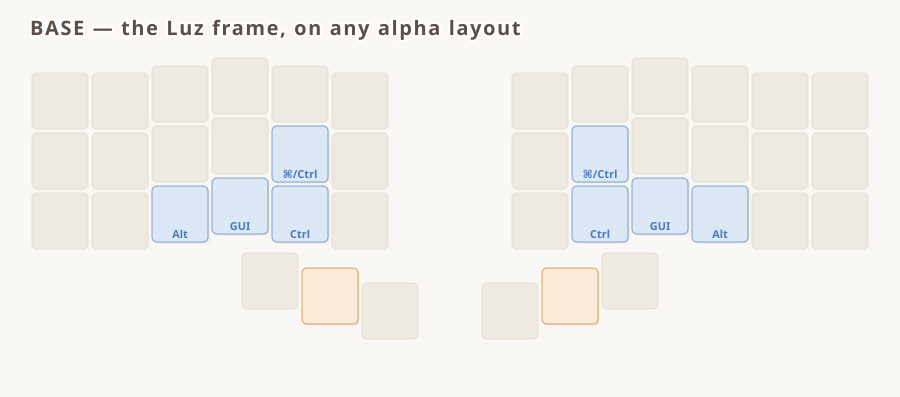
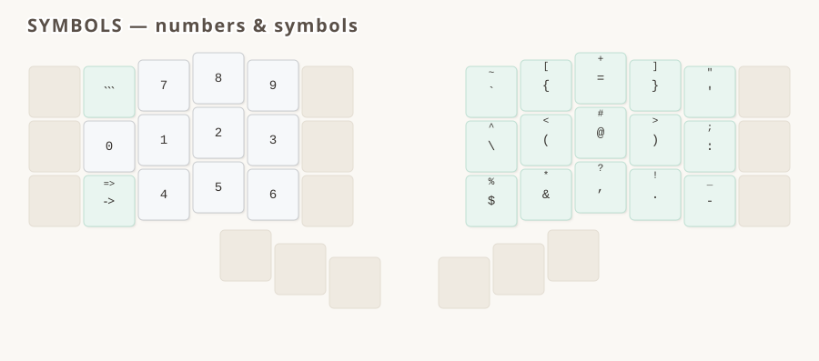
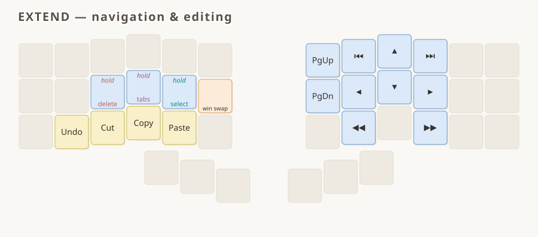
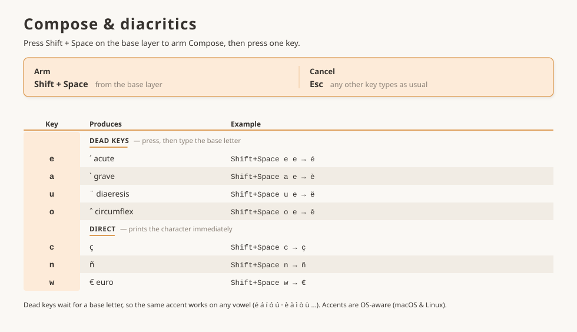

# Luz — keymap conventions for 3x6+3 keyboards



**Luz** (Spanish: *luz* /luθ/, "light") turns any alpha layout (Graphite, Focal, Canary… or QWERTY) into a complete keymap. Your layout places the letters; Luz supplies the rest (symbols, numbers, navigation, editing, modifiers and accents) as one consistent set of keymap conventions. Each keymap built this way is a **variant**:

| Variant | Letters | Keymap |
|---------|---------|--------|
| **Luz for Gallium** | Gallium East | [`luz_for_gallium`](./keyboards/6x3_3/keymaps/luz_for_gallium/README.md) |
| **Luz for Enthium** | Enthium | [`luz_for_enthium`](./keyboards/6x3_3/keymaps/luz_for_enthium/README.md) |
| **Luz for Colemak-DH** | Colemak Mod-DH (matrix) | [`luz_for_colemak_dh`](./keyboards/6x3_3/keymaps/luz_for_colemak_dh/README.md) |
| **Luz for QWERTY** | QWERTY | [`luz_for_qwerty`](./keyboards/6x3_3/keymaps/luz_for_qwerty/README.md) |

## What you get, out of the box

> [!NOTE]
> The diagrams below are simplified to highlight each feature. See each variant's README (table above) for the full layout.

### BASE layer — alphas, mods & layers

- **Bottom-row mods.** Modifiers sit under the less frequent letters, so the home row has no dual-function keys.
- **A lightweight thumb cluster.** Plain Shift with Caps Word on double tap, layer holds, Enter, Space.
- **OS-aware Cmd/Ctrl.** On the inner index column: `⌘C` on macOS, `Ctrl-C` on Linux.



### Numbers & Symbols

- **A rethought symbol vocabulary.** The symbol set is redesigned for mnemonics and frequency, and every symbol's Shift gives a *related* glyph (`(` shifts to `<`, `{` to `[`, `=` to `+`).
- **Digits on the left hand.** The symbols layer turns the left hand into a number pad: `1 2 3` across the home row with `0` beside them, `4 5 6` below, `7 8 9` above.
- **Mods survive the layer switch.** Hold `Ctrl`, `Alt` or `Cmd`, then enter the symbols layer: the mods stay on until you leave it, freeing that hand for the number pad. Shift is the exception.



### Navigation & Editing

- **Inverted-T arrows, no modifiers.** The further a key sits from home, the further it moves: character, word, line, page.
- **Left-hand modes.** Left-hand triggers turn the same keys into **select**, **delete** (by character, word or line), or **browser tab** controls.




### Compose — accents, without a layer of its own

- **Accents via Compose.** Press `Shift` then `Space` (both thumbs, same keys on every variant), and the next key gets an accent: `é à ü ô ñ`, plus `ç` and `€`. Anything else is on AltGr.



---

## Make it personal

Luz **deliberately leaves blanks** on several layers. They're yours: map whatever suits your workflow, without disturbing the shared frame.

Go further whenever you like: swap the editing commands on the navigation layer, promote other symbols to the base layer, tuck something under the navigation thumb. To check that a change keeps you compatible with the other variants, [`LUZ.spec.md`](./LUZ.spec.md) opens with a one-minute checklist.

---

## Contributing variants

**New variants are very welcome.** If your favourite alpha layout doesn't have one yet, copy an existing variant and follow [`LUZ.spec.md`](./LUZ.spec.md), the contract every variant meets. Open an issue to discuss, or send a pull request.

---

## Building

I have run these keymaps on:

| MCU | Example keyboard |
|-----|------------------|
| STM32 | **Kaly42** (`kaly/kaly42`) |
| RP2040 | **Cantor Pro v3** (`42keebs/cantor_pro/v3/left`) |

Build a single target, or all of them at once:

```bash
qmk compile -kb 42keebs/cantor_pro/v3/left -km luz_for_gallium
qmk userspace-compile
```

## Going further

- [`LUZ.spec.md`](./LUZ.spec.md) — the exact, implementation-facing contract: every layer, keycode, position, and rule.
- [`TUNING.md`](./TUNING.md) — four tap-hold settings left deliberately open, with the arguments on each side.
- The variant READMEs (linked in the table at the top) — diagrams and per-layout specifics.
- [`keyboards/6x3_3/luz/`](./keyboards/6x3_3/luz/) — the shared code the variants compile against.

## Inspiration

- **[HandsDown](https://sites.google.com/alanreiser.com/handsdown)** — semantic, platform-aware editing commands
- **[Miryoku](https://github.com/manna-harbour/miryoku)** — minimal, consistent layers built on home-row mods
- **[Seniply](https://stevep99.github.io/seniply/)** — the Extend layer: one-handed navigation and editing without leaving home
- **[Anymak](https://github.com/rpnfan/Anymak/)** — a complete keymap designed to sit on top of any alpha layout
- **[Gallium](https://github.com/GalileoBlues/Gallium) East** & **[Enthium](https://github.com/sunaku/enthium)** — the alpha layouts
- **Pascal Getreuer's QMK work** — Chordal Hold, Caps Word, and the wider tap-hold tuning vocabulary
- **Callum-style oneshot modifiers** — an early influence
- **[keymap-drawer](https://github.com/caksoylar/keymap-drawer)** — the layer diagrams

## License

GPL-2.0-or-later (following QMK licensing)
