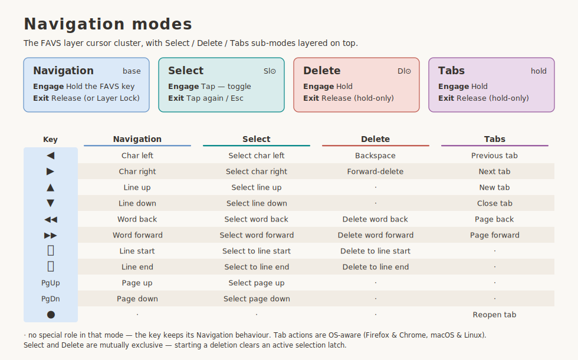
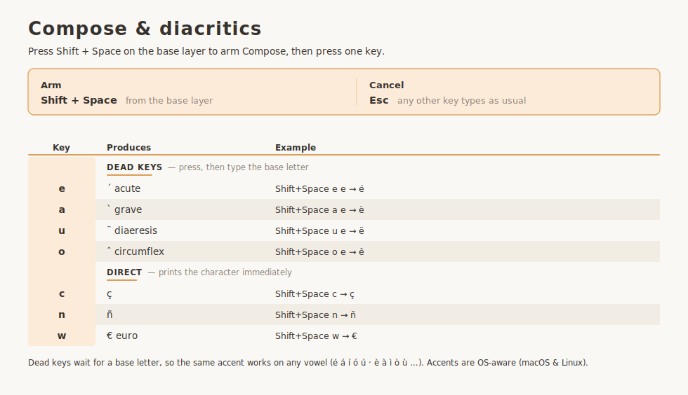

# `enthium` — Luz for Enthium *(WIP)*

`enthium` ports the [Luz](../../../../LUZ.md) conventions onto the **Enthium** alpha layout,
with the hands mirrored. Everything above BASE is shared with `crafted`; only the alpha layer
differs. See [`LUZ.md`](../../../../LUZ.md) for the shared interaction model.

> [!NOTE]
> Work in progress — the layout is still settling, so details here may change.

## The layers

<!-- KEYMAP DRAWER -->


<!-- END KEYMAP DRAWER -->



> [!NOTE]
> A printable PDF lives at [`keymap_drawer/enthium.pdf`](./keymap_drawer/enthium.pdf).

## Reference tables

> [!NOTE]
> Searchable, greppable text twins of the diagrams above. Auto-generated from
> `keymap_drawer/make_*_page.py`. The navigation and Compose behavior is shared Luz, so these
> match `crafted`.

<details>
<summary><strong>Navigation modes</strong></summary>

EXTEND cursor layer + Select / Delete / Tabs sub-modes

<!-- BEGIN NAV TABLE -->

| Key | Navigation (EXTEND layer) | Select (tap Sl⊙) | Delete (hold Dl⊙) | Tabs (hold tab key) |
|-----|------|------|------|------|
| ◀ | Char left | Select char left | Backspace | Previous tab |
| ▶ | Char right | Select char right | Forward-delete | Next tab |
| ▲ | Line up | Select line up | · | New tab |
| ▼ | Line down | Select line down | · | Close tab |
| ◀◀ | Word back | Select word back | Delete word back | Page back |
| ▶▶ | Word forward | Select word forward | Delete word forward | Page forward |
| ⏮ | Line start | Select to line start | Delete to line start | · |
| ⏭ | Line end | Select to line end | Delete to line end | · |
| PgUp | Page up | Select page up | · | · |
| PgDn | Page down | Select page down | · | · |
| ● | · | · | · | Reopen tab |

`·` = the key keeps its Navigation role in that mode. Select and Delete are mutually exclusive. Tab actions are OS-aware (Firefox & Chrome, macOS & Linux).

<!-- END NAV TABLE -->

</details>

<details>
<summary><strong>Compose &amp; diacritics</strong></summary>

Type `Shift + Space` while on BASE, then a key.

<!-- BEGIN DIACRITICS TABLE -->

| Key | Produces | Example |
|-----|----------|---------|
| `e` | ´ acute (dead key) | `Shift+Space`, `e`, `e` → é |
| `a` | \` grave (dead key) | `Shift+Space`, `a`, `e` → è |
| `u` | ¨ diaeresis (dead key) | `Shift+Space`, `u`, `e` → ë |
| `o` | ˆ circumflex (dead key) | `Shift+Space`, `o`, `e` → ê |
| `c` | ç | `Shift+Space`, `c` → ç |
| `n` | ñ | `Shift+Space`, `n` → ñ |
| `w` | € (euro) | `Shift+Space`, `w` → € |

Armed from the **base layer** with Shift + Space. Dead keys wait for a base letter, so the same accent works on any vowel; any unlisted key cancels.

<!-- END DIACRITICS TABLE -->

</details>

## Building

```bash
qmk compile -kb kaly/kaly42 -km enthium
qmk compile -kb 42keebs/cantor_pro/v3/left -km enthium
```
